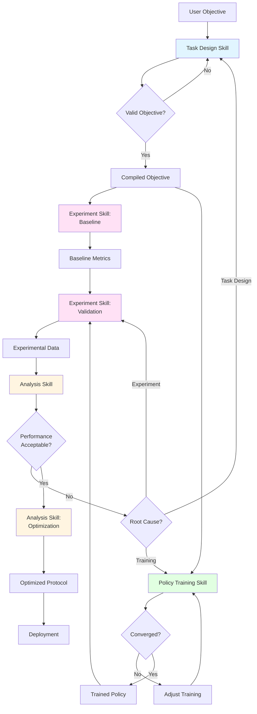
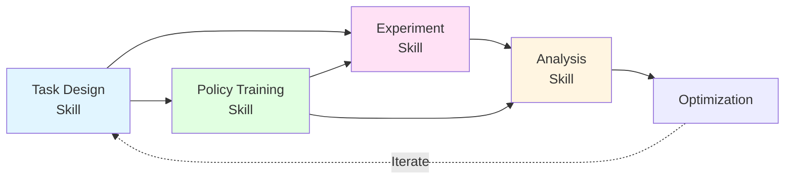
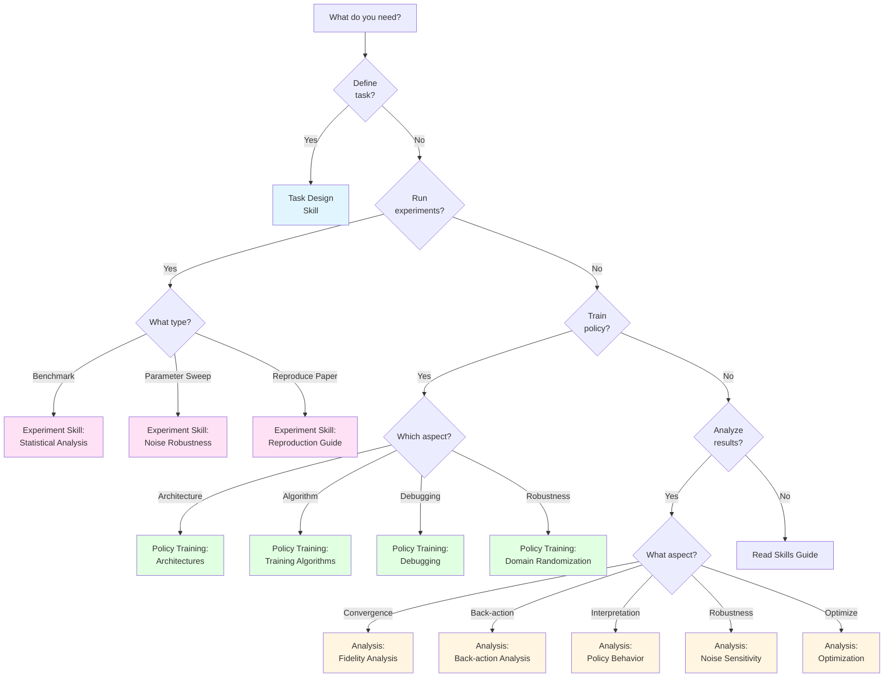
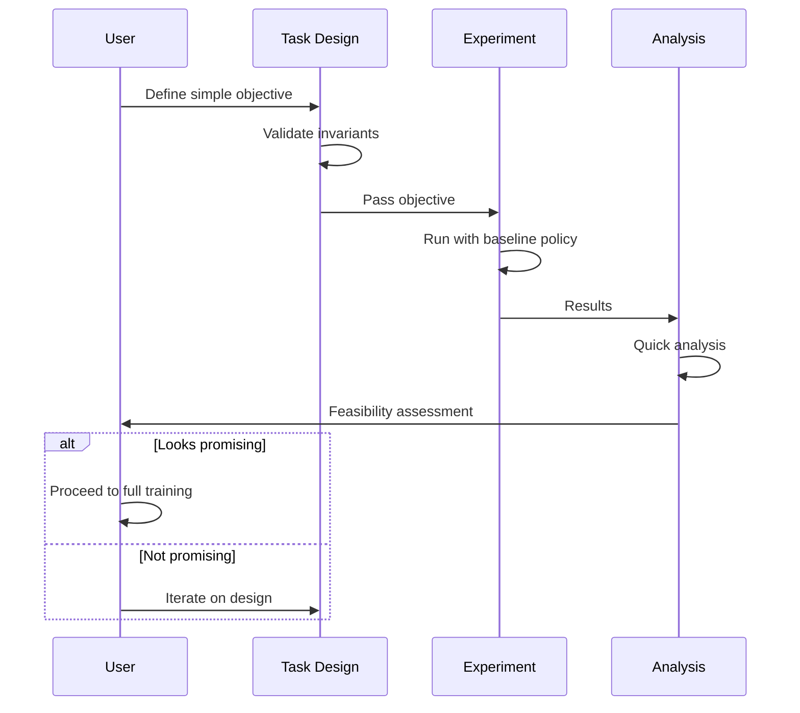
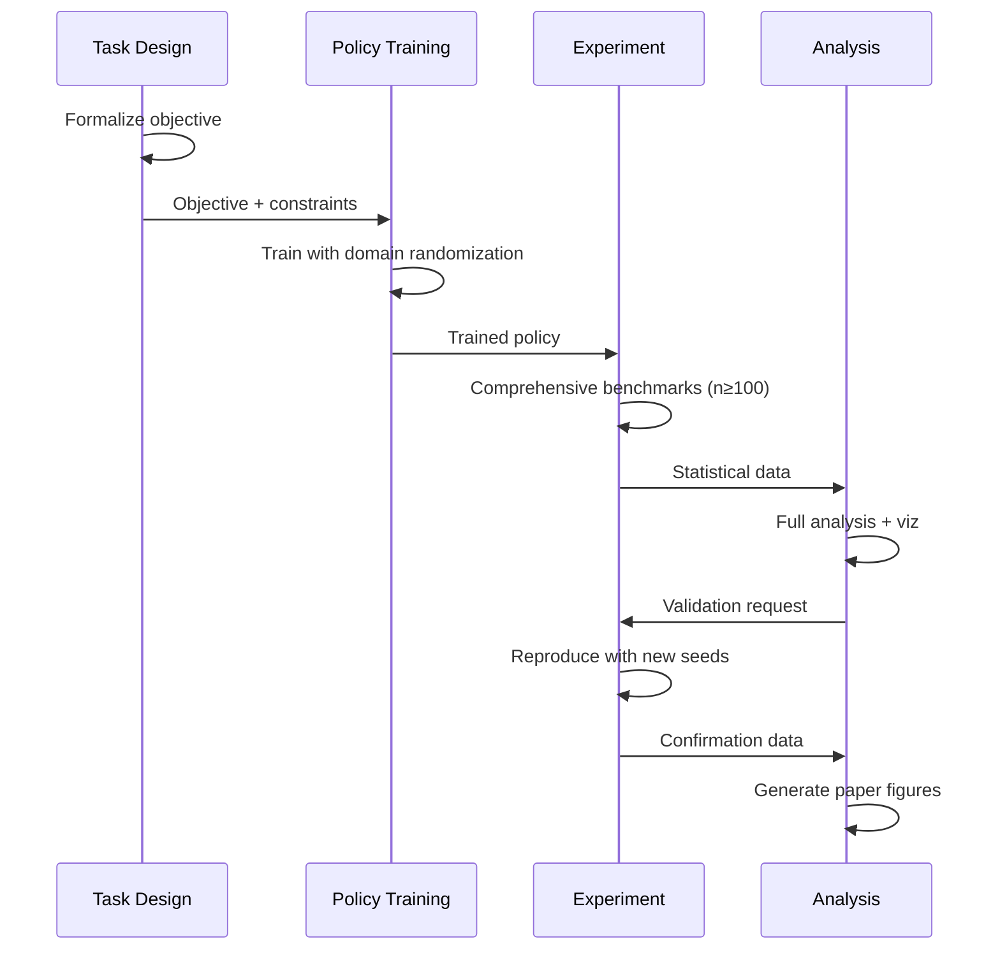
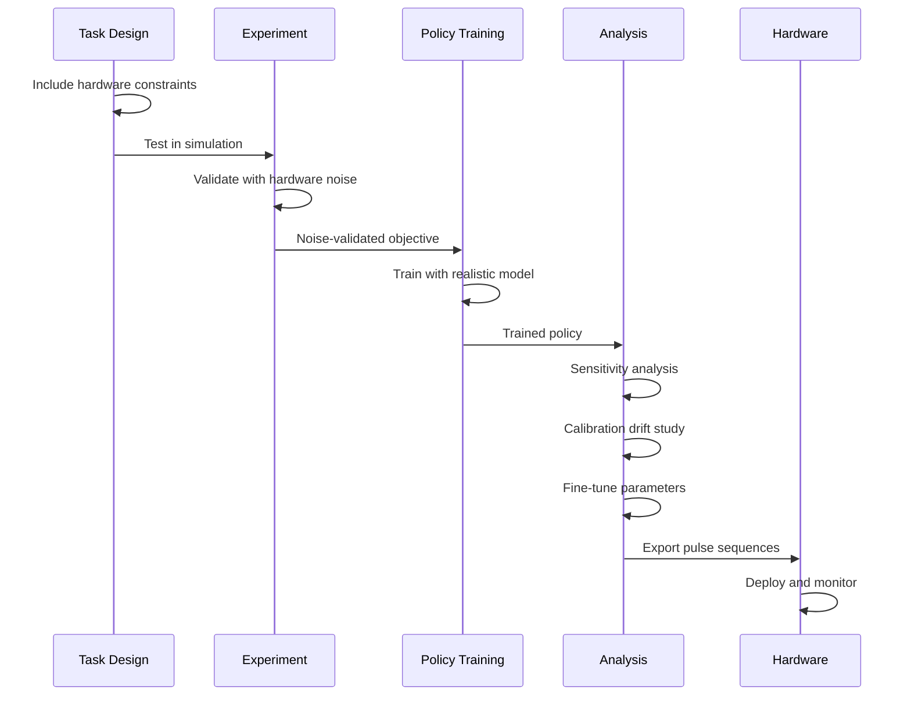
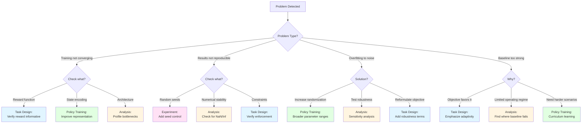
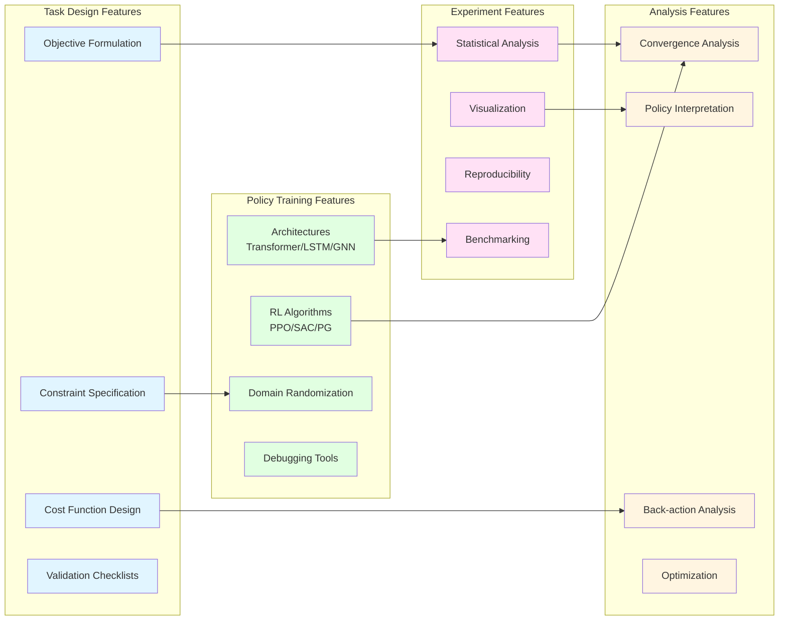

# UMM Skills Ecosystem - Visual Workflow

This document provides visual representations of how the UMM skills work together.

## Complete Workflow Diagram



## Skill Dependencies



## Decision Tree for Skill Selection



## Rapid Prototyping Pattern



## Research Publication Pattern



## Hardware Deployment Pattern



## Iterative Refinement Cycle

```mermaid
graph LR
    A[Iteration 1] --> B[Task Design]
    B --> C[Experiment: Baseline]
    C --> D[Analysis: Gaps]
    
    D --> E[Iteration 2]
    E --> F[Task Design: Refine]
    F --> G[Policy Training]
    G --> H[Experiment: Validation]
    H --> I[Analysis: Performance]
    
    I --> J[Iteration 3]
    J --> K[Optimization]
    K --> L[Final Experiment]
    L --> M[Comprehensive Analysis]
    
    M --> N[Deployment]
    
    style B fill:#e1f5ff
    style C fill:#ffe1f5
    style D fill:#fff5e1
    style F fill:#e1f5ff
    style G fill:#e1ffe1
    style H fill:#ffe1f5
    style I fill:#fff5e1
    style K fill:#fff5e1
    style L fill:#ffe1f5
    style M fill:#fff5e1
```



## Cross-Skill Problem Solving



## Skill Feature Matrix



## Legend

- 🔵 **Task Design** (Blue): Objective formulation and specification
- 🔴 **Experiment** (Pink): Running experiments and validation  
- 🟢 **Policy Training** (Green): Training adaptive measurement policies
- 🟡 **Analysis** (Yellow): Interpreting results and optimization

## Quick Navigation

Based on your current phase:

| Phase | Primary Skill | Supporting Skills |
|-------|--------------|-------------------|
| **Starting new project** | Task Design | Skills Guide |
| **Establishing baselines** | Experiment | Task Design |
| **Developing policies** | Policy Training | Task Design, Experiment |
| **Validating results** | Experiment | Analysis |
| **Understanding behavior** | Analysis | Experiment |
| **Optimizing protocols** | Analysis | All skills |
| **Debugging issues** | Analysis | All skills |

## Workflow Complexity Levels

### Level 1: Simple (1-2 days)
```
Task Design → Experiment (baseline) → Quick Analysis
```

### Level 2: Standard (1-2 weeks)  
```
Task Design → Policy Training → Experiment → Analysis
```

### Level 3: Comprehensive (2-4 weeks)
```
Task Design → Baseline Experiment → Policy Training → 
Validation Experiment → Full Analysis → Optimization → 
Reproduction
```

### Level 4: Publication (1-2 months)
```
Task Design (with theory) → Multiple Policy Variants → 
Extensive Experiments → Statistical Analysis → 
Ablation Studies → Noise Characterization → 
Optimization → Multiple Reproductions → Paper Writing
```

---

**Ready to start?** Pick your workflow level and follow the corresponding skill sequence. The Skills Guide provides detailed integration patterns for each level.
