# UMM Skills Ecosystem - Visual Workflow

This document provides visual representations of how the UMM skills work together.

## Complete Workflow Diagram


## Skill Dependencies


## Decision Tree for Skill Selection


## Rapid Prototyping Pattern


## Research Publication Pattern

```mermaid
sequenceDiagram
    participant TD as Task Design
    participant PT as Policy Training
    participant EX as Experiment
    participant AN as Analysis
    
    TD->>TD: Formalize objective
    TD->>PT: Objective + constraints
    PT->>PT: Train with domain randomization
    PT->>EX: Trained policy
    EX->>EX: Comprehensive benchmarks (n≥100)
    EX->>AN: Statistical data
    AN->>AN: Full analysis + viz
    AN->>EX: Validation request
    EX->>EX: Reproduce with new seeds
    EX->>AN: Confirmation data
    AN->>AN: Generate paper figures
```



## Hardware Deployment Pattern


## Iterative Refinement Cycle


## Cross-Skill Problem Solving


## Skill Feature Matrix


## Legend

- 🔵 **Task Design** (Blue): Objective formulation and specification
- 🔴 **Experiment** (Pink): Running experiments and validation  
- 🟢 **Policy Training** (Green): Training adaptive measurement policies
- 🟡 **Analysis** (Yellow): Interpreting results and optimization

## Quick Navigation

Based on your current phase:

| Phase | Primary Skill | Supporting Skills |
|-------|--------------|-------------------|
| **Starting new project** | Task Design | Skills Guide |
| **Establishing baselines** | Experiment | Task Design |
| **Developing policies** | Policy Training | Task Design, Experiment |
| **Validating results** | Experiment | Analysis |
| **Understanding behavior** | Analysis | Experiment |
| **Optimizing protocols** | Analysis | All skills |
| **Debugging issues** | Analysis | All skills |

## Workflow Complexity Levels

### Level 1: Simple (1-2 days)
```
Task Design → Experiment (baseline) → Quick Analysis
```

### Level 2: Standard (1-2 weeks)  
```
Task Design → Policy Training → Experiment → Analysis
```

### Level 3: Comprehensive (2-4 weeks)
```
Task Design → Baseline Experiment → Policy Training → 
Validation Experiment → Full Analysis → Optimization → 
Reproduction
```

### Level 4: Publication (1-2 months)
```
Task Design (with theory) → Multiple Policy Variants → 
Extensive Experiments → Statistical Analysis → 
Ablation Studies → Noise Characterization → 
Optimization → Multiple Reproductions → Paper Writing
```

---

**Ready to start?** Pick your workflow level and follow the corresponding skill sequence. The Skills Guide provides detailed integration patterns for each level.
